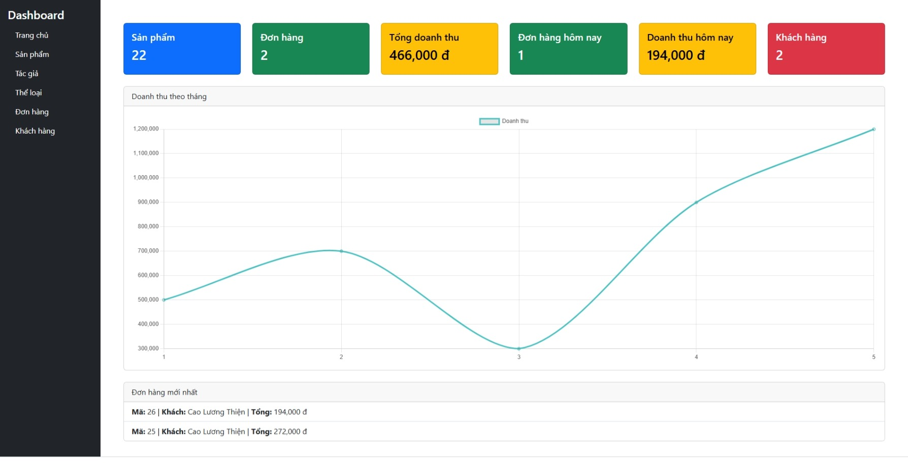

# Book Store - Laravel 10

Ứng dụng **Book Store** được xây dựng bằng **Laravel 10** cho phép quản lý sách, tác giả, thể loại và đơn hàng. Đây là dự án minh họa kỹ năng **CRUD, MVC, Blade components, Eloquent, pagination, DataTables** – phù hợp để học tập hoặc triển khai nhỏ.

---

## 💡 Tính năng

-   Quản lý **sách, tác giả, thể loại** (CRUD đầy đủ)
-   Upload ảnh sản phẩm
-   Phân trang Laravel và hiển thị **STT chính xác theo trang**
-   Sử dụng **Blade components** để tái sử dụng code (button, modal, table)
-   Bundle **JS/CSS bằng Vite** để tối ưu hiệu suất

---

## 🛠️ Yêu cầu hệ thống

-   PHP >= 8.1
-   Composer
-   Node.js >= 18
-   MySQL / MariaDB
-   Laravel >= 10.x

---

## ⚙️ Hướng dẫn cài đặt

1. **Clone repository**

```bash
git clone https://github.com/thienok990/book_store.git
cd book_store
```

2. **Cài đặt dependencies**

```bash
composer install
npm install
```

3. **Copy file cấu hình môi trường**

```bash
cp .env.example .env
```

-   Cấu hình database trong `.env`:

```
DB_CONNECTION=mysql
DB_HOST=127.0.0.1
DB_PORT=3306
DB_DATABASE=book_store
DB_USERNAME=root
DB_PASSWORD=
```

4. **Tạo key ứng dụng**

```bash
php artisan key:generate
```

5. **Import dữ liệu từ file SQL**

Thay vì chạy migration và seed, bạn import trực tiếp file SQL:
```bash
-   Mở công cụ quản lý MySQL bạn đang dùng (PHPMyAdmin, HeidiSQL, DBeaver…).

-   Tạo một database mới, ví dụ book_store.

-   Chọn database vừa tạo → Import → chọn file book_store.sql trong thư mục database.

-   Nhấn “Go” hoặc “Start” để import toàn bộ dữ liệu.
```

6. **Tạo symbolic link cho storage**

Laravel cần symbolic link để truy cập các file upload:

```bash
php artisan storage:link
```
7. **Build assets bằng Vite**

```bash
npm run build
```

-   Hoặc dev mode:

```bash
npm run dev
```

8. **Chạy server**

```bash
php artisan serve --host=localhost --port=8000
```

-   Truy cập: `http://localhost:8000`

---

## 📂 Cấu trúc dự án nổi bật

-   `app/Models` – chứa các model như Book, Author, Category
-   `app/Http/Controllers` – controller xử lý logic
-   `resources/views/admin` – Blade template quản lý dashboard
-   `resources/js/app.js` – bundle JS (Bootstrap, jQuery, DataTables)
-   `resources/css/app.css` – bundle CSS (Bootstrap, DataTables)
-   `database/seeders` – seed dữ liệu mẫu

---

## 🌟 Kỹ năng áp dụng / Highlight

-   **Laravel MVC & Eloquent ORM**
-   **Blade components** và reusable views
-   **CRUD + Validation + File Upload**
-   **Pagination Laravel + DataTables**
-   **JS/CSS bundling bằng Vite**
-   **Responsive design & Bootstrap 5**

---

## 🚀 Demo

-   Chạy local bằng `php artisan serve --host=localhost --port=8000`
-   Tài khoản admin: `thiencao.work@gmail.com`, mật khẩu: `Thienok990`
-   Trang admin: quản lý sách, tác giả, thể loại với giao diện dễ sử dụng


**Trang chủ**


**Trang Dashboard**


**Danh sách Sản Phẩm**


**Form thêm Sản Phẩm**


**Danh sách Tác Giả**


**Danh sách Thể loại**


**Danh Sách Đơn Hàng**


**Giỏ Hàng**


**Thông Tin Cá Nhân**


**Thông Tin Đơn Hàng**

